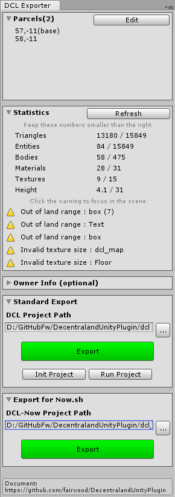
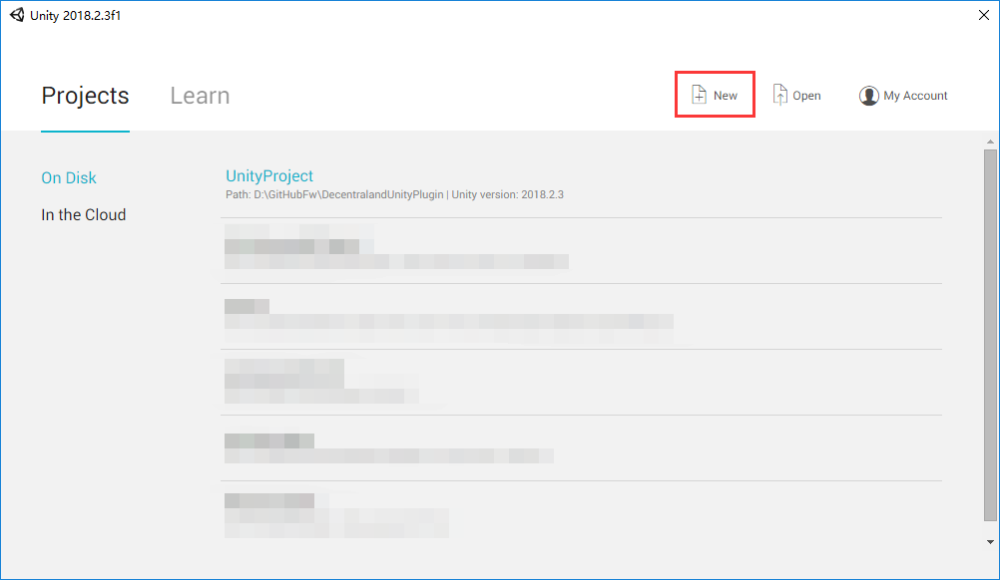
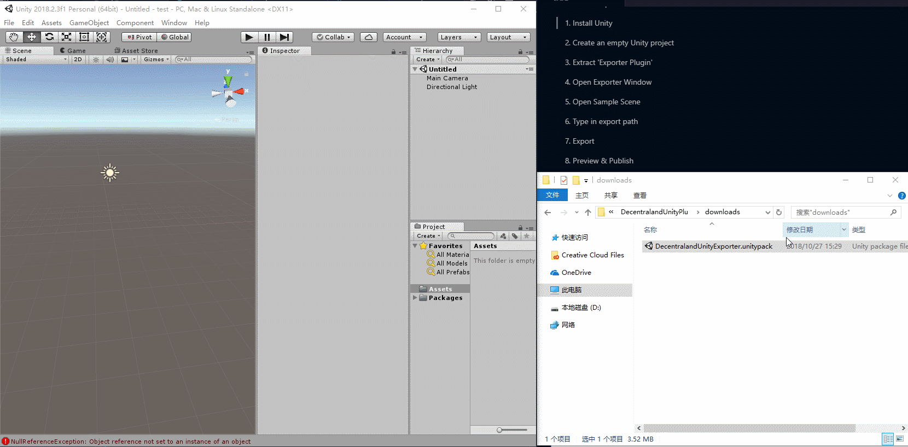
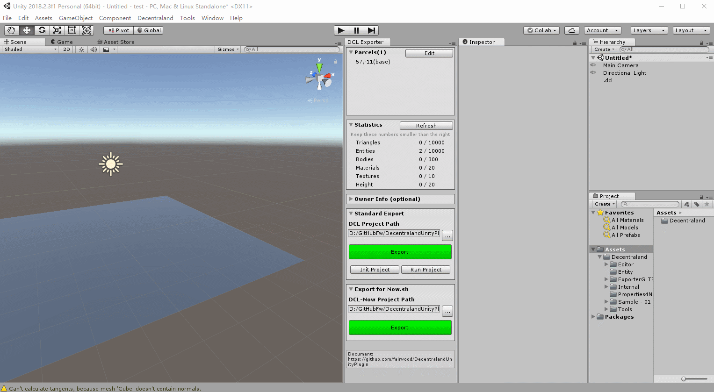
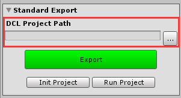
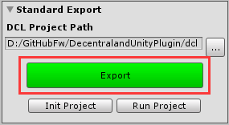
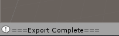

# Quick Guide



Follow these steps to know how this tool works:

1. Install Unity

1. Create an empty Unity project

1. Install the Exporter

1. Open Sample Scene

1. Type in export path

1. Export

1. Preview & Publish

## 1. Install Unity

[Unity 5.x\2017\2018 or higher](https://store.unity.com/download)

## 2. Create an empty Unity project

Run Unity and click 'New'.



## 3. Install the Exporter

[Download the exporter here](https://github.com/fairwood/DecentralandUnityPlugin/blob/master/downloads/DecentralandUnityExporter.unitypackage)

Drag it into Unity and open the exporter window.



## 4. Open the sample scene



## 5. Select an folder to export



## 6. Export

Click ```Export``` button.



It is done when you see "Export Complete" in the console.



Go to the target folder, you will find your DCL project.

## 7. Preview & Publish

You have 2 ways to preview and publish.

### 1. To Now.sh

**Easy to start. Less softwares to install. Can share to others. Recommended for the non-professional.**

Need to install:

- Now.sh

Follow [Export to Now.sh](./docs/ExportToNow.md).

### 2. As A Complete DCL Project

**Recommended for professional developers.**

If you are going to preview the scene on your computer, or deploy the scene to IPFS, you should go this way.

Need to install:

- Node.js

- Decentraland SDK

You can follow the [DCL official document](https://docs.decentraland.org/getting-started/installation-guide/) to setup the Decentraland SDK.

## To know deeper about this tool, go to [More about Decentraland Unity Plugin](./docs/Introduction.md)

# Special Thanks

## Support from Decentraland Team

Ari Meilich

[Esteban Ordano](https://github.com/eordano)

Matias Bargas

Jayson Hu

Diff


## Unity-glTF Tools

[@neil3d/Unity-glTF-Exporter](https://github.com/neil3d/Unity-glTF-Exporter)

# Donate Us

#### ETH/MANA/LAND/ERC20...

 0x1a38ac06099D648Bb14418D61956133a3d0E1f1C

#### BTC

1JEFCP4hqa3Gd7aQ5unWoLP6S6mD17K9HQ