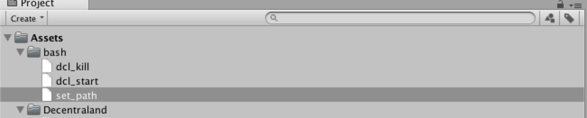
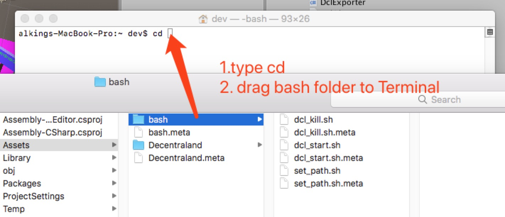
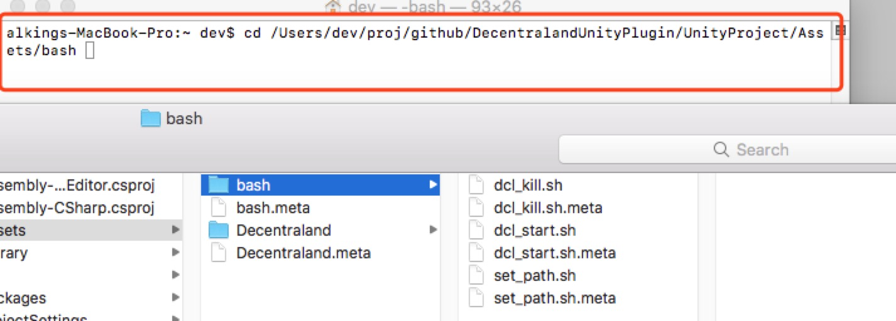
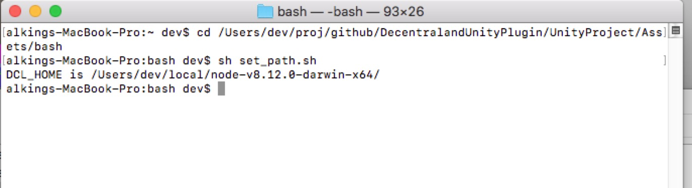
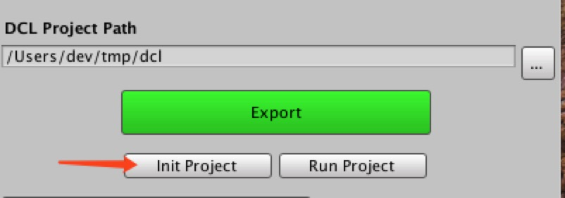
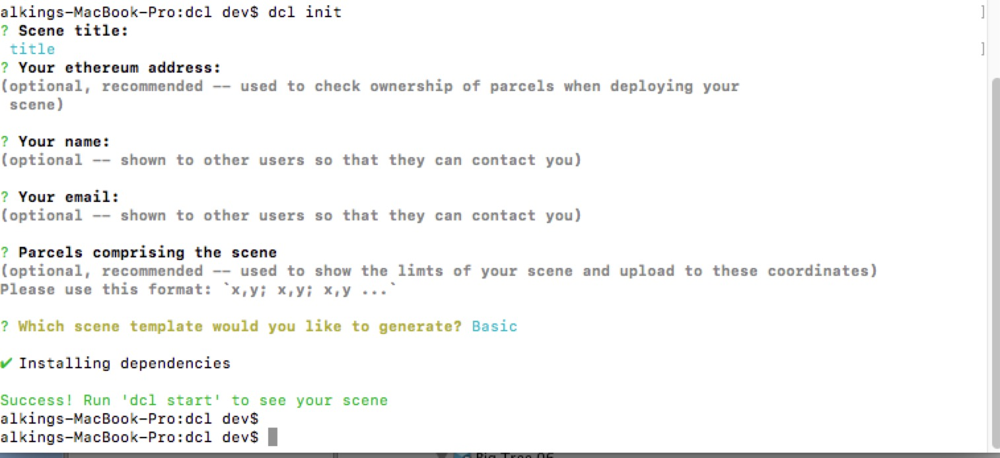
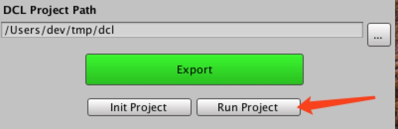

# mac set up tutorial

### 1. set PATH value



##### 1. right click ```set_path.sh``` and then click ``` Reveal in Finder```
##### 2. open ``` Terminal``` application
##### 3. cd to ``` bash folder```



##### 4. type ``` sh set_path.sh```
it will print sothing like ```DCL_HOME is ... ```



### 2. init dcl project
##### 1. in Unity Window,choose dcl project path, and click ``` Init Project```

it will open Terminal Application automatic

##### 2. init dcl project by type cmd ``` dcl init```


##### 3. you can type cmd ``` dcl start ``` to view sample scene

### 3. start dcl project


### 4. kill dcl process
like step 1, execute script ``` dcl_kill.sh```