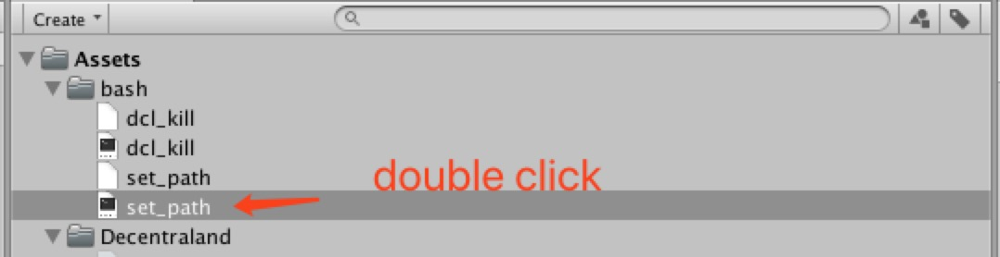
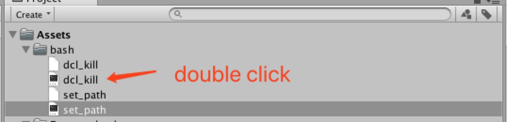

# Mac set up tutorial

### 1 Set PATH value



### 2. Init dcl project
##### 2.1 In Unity Window,choose dcl project path, and click ``` Init Project```


it will open ```Terminal``` application automatic

##### 2.2 Init dcl project by type cmd ``` dcl init```


##### 2.3 You can type cmd ``` dcl start ``` to view sample scene

### 3. Start dcl project


### 4. Kill dcl process
