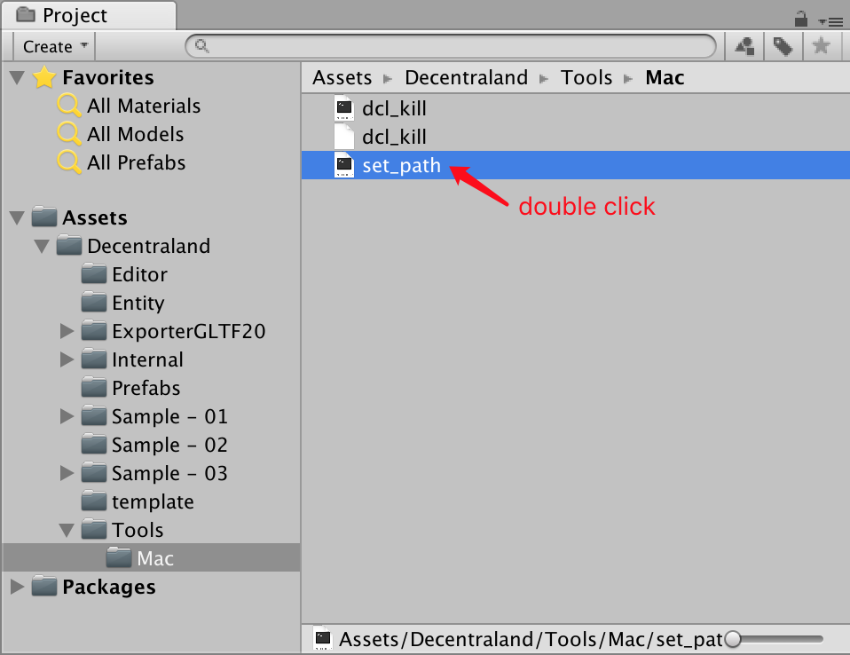
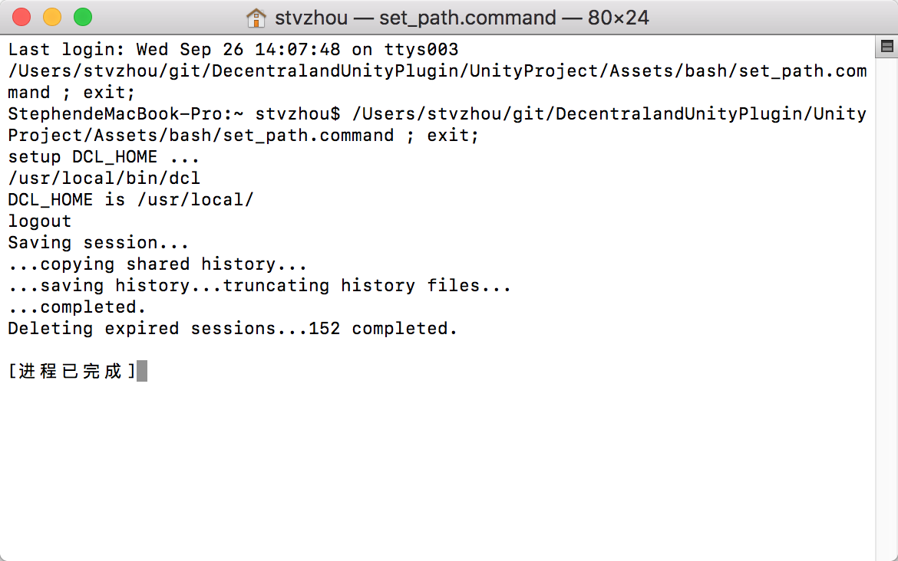
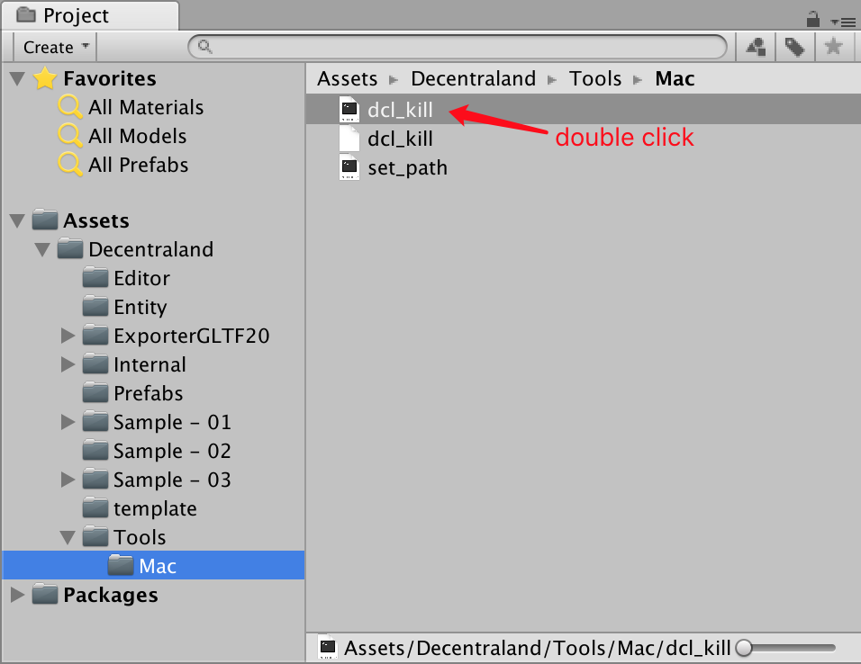

# Mac Set Up Tutorial

## 1. Double click the set_path file to set PATH value.



A terminal window will open saying the process is completed. Close it.



After that, you will be able to use ```Init Project``` and ```Start Project``` buttons.

## 2. Init DCL project

### 2.1 In Unity Window,choose dcl project path, and click ```Init Project```


it will open ```Terminal``` application automatically.

### 2.2 Init dcl project by type cmd ``` dcl init```


### 2.3 You can type cmd ``` dcl start ``` to view sample scene

## 3. Start DCL project


## Kill dcl process

DCL process on MacOS has a problem that the process will not stop after you shutdown the ternimal. So we provide a script to kill all DCL processes. Just double-click it either in Unity or Finder.

